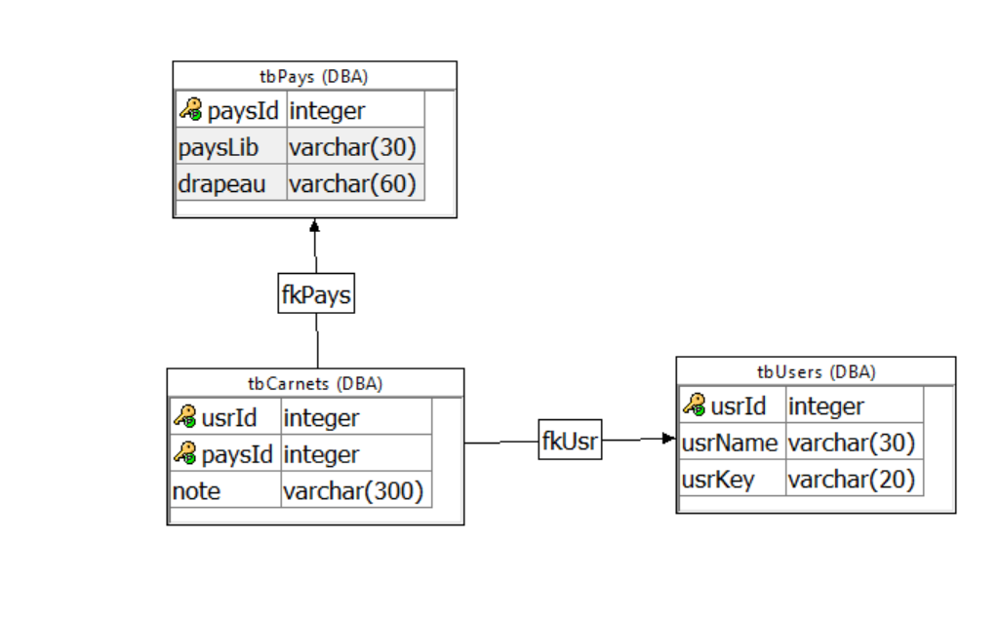

# Le-monde-sur-le-dos
Le site fait pour les voyageurs nés.
 
Projet de fin d'année 1TL2, cours de "structures et données".
 
<h2>Objectif:</h2>
 
Ce site recense tout les pays que vous avez visités et vous permet de prendre des notes de ses voyages.
<h2>Fonctionnalités principales:</h2>
 
<ol>
  <li>Avoir une liste des pays déjà visité.</li>
  <li>Avoir des notes sur les pays.</li>
  <li>Avoir un tableau avec le drapeau du pays qui s'affiche à chaque pays visité</li>
</ol>
<h2>Fonctionnalités secondaires:</h2>
 
Le site propose un systeme de login/register afin de sauvegarder nos voyages.
<h2>Createur:</h2>
 
<ul>
  <li>Delannoit Grégoire</li>
</ul>
 
<h2>Tables</h2>

<ul>
  <li><b>tbPays:</b> contient un identifiant pays, qui sert de primary key, ainsi qu'un libellé et le     drapeau du pays.</li>
  <li><b>tbUsers:</b> contient un identifiants user, qui sert de primary key, et nom utilisateurs       ainsi qu'un mot de passe.</li>
  <li><b>tbCarnets:</b> contient l'identifiant user et pays qui servent tout deux de primary ET de foreign key, et comporte egalement une note sur le pays.</li>
</ul> 
 
<h2>Webservices</h2>
 
A venir
